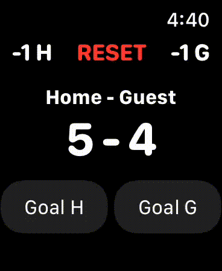
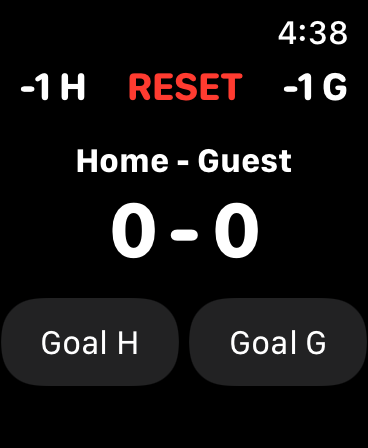
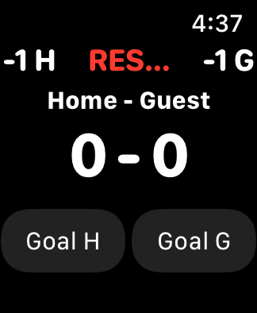
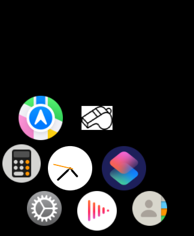

This is a very simple **Standalone WatchOS App** for Handball referees

# Functionalities:
- Count Goals on your apple watch for each team
- See Goals for each team on watch
- Correct Goals for each team
- Reset Goals Counter completely (only with confirmation - therefore an unintentional reset is not possible)
- Background running capability
- Nothing more (yes this is a feature - as other things tend to distract only during a game)

**Demo Video of functionalities:**

 
 

# Note on stability:
- This app has been tested only a few times yet
- In case of a bug please create an issue

 
 

# Note on compatibility:
- As this app is simply it should run on every Apple Watch
- **Please note that it has been optimized for the 44mm+ Watches:**\
\
***On smaller Apple Watches it will still work fully but the reset button will be shrinked:***\

 
 

# How to run this
- **You need a mac with Xcode!**
- Clone the repo to your computer
- Open the project in Xcode
- Connect your iPhone (that needs to be connected to your Apple Watch)
- In the upper menu click on the 'Product' tab and in the now opened drop down menu select 'Destination' -> There select your connected iPhone
- Now click the Play Button in the upper left in Xcode (*Xcode will then build and load the App to your Watch*)
- If this succeeds you should find the App on your Apple Watch:\

 
 

# Troubleshooting
- If the building fails:
1. Make sure that your iPhone is connected properly and also trusts your mac
2. Check if you have a Signing Certificate installed in Xcode (click on the root app icon in the folder menu and there check every Target --> each Target should have a signing certificate as well as a Team) ==> ***If this is not the case create one (the internet is your friend for this)***

 
 

# App Icon Image Source:
https://uxwing.com/whistle-icon/

Icons compiled for Apple Watch with: https://appicon.co/
